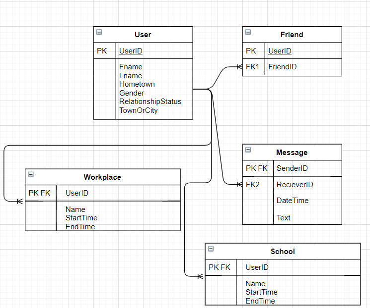

# Introduction
The following is documentation on the coursework assignment for the ISAD157 module. This will contain the requirements, design process and a description of the final implementation. It will also contain a link to the remote git repository that houses the files for the project.
If you want to understand the final implementation and don’t want to read through the full design process then skip to the implementation section.
> I will be referring to the system user as “System User” and a user that is stored in the database as “User”.

## List of High Level Functions
This is a list of all the functions that the final implementation of the system needs to have.
- Search User
- View User Information
- View Users Friends
- View Users Messages
- Add User
- Edit User
- Delete User
- Add Friend
- Delete Friend
- Implementation
## Entity Diagram of Database
This is the entity diagram representation of the database that the system is using to power the data behind the system.

## Included Functions
This is a list of the functions that the prototype is going to implement, these are taken from the high level functions list in this document.
- Search User
- View User Information
- View Users Friends
- View Users Messages

This means I won’t be implementing the ability to edit, add or delete a user, add a friend or delete a friend. This is because these were extra capabilities that aren’t essential to demonstrate the systems potential.
## Interface Design
This is a diagram of the intended final design

This is a diagram of the final design
## Program Structure
The general structure will be a frontend that uses the different methods that each class has as well as a general custom library that handles the functions that is used by a lot of different methods such as searching the database and retrieving database records.
# Appendix
SQL Syntax Checker - https://www.eversql.com/sql-syntax-check-validator/
